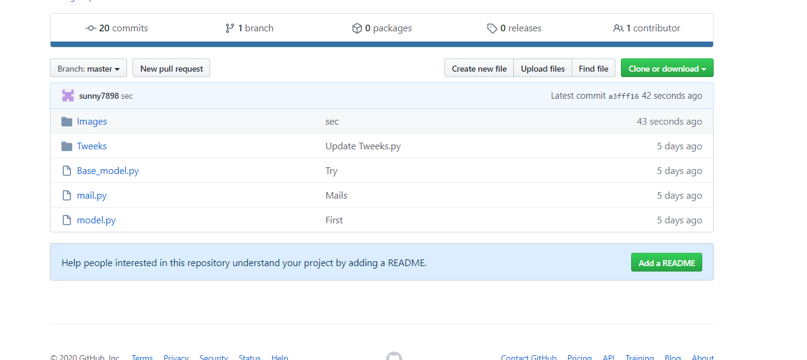
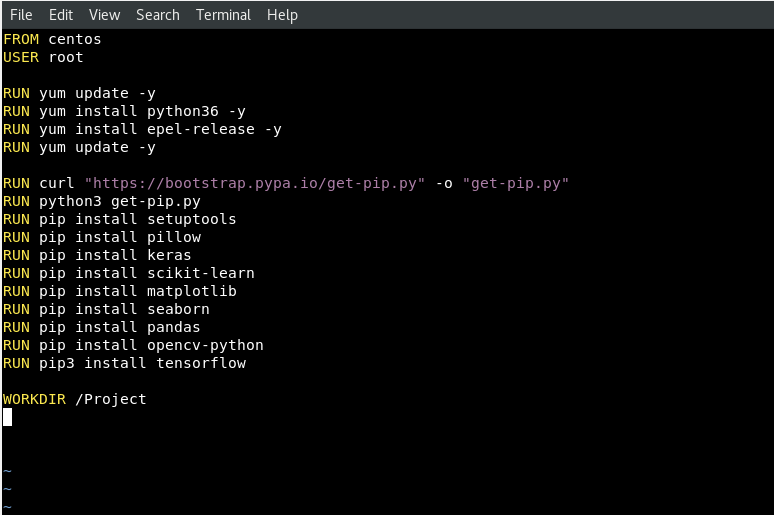
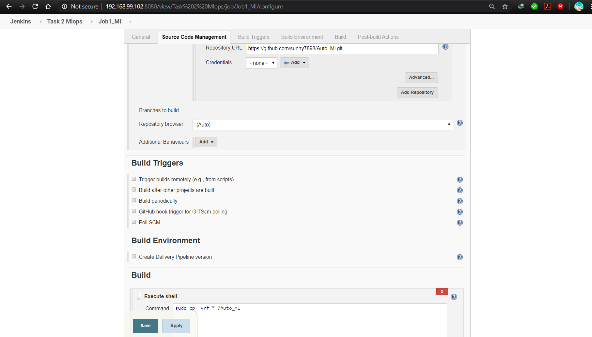
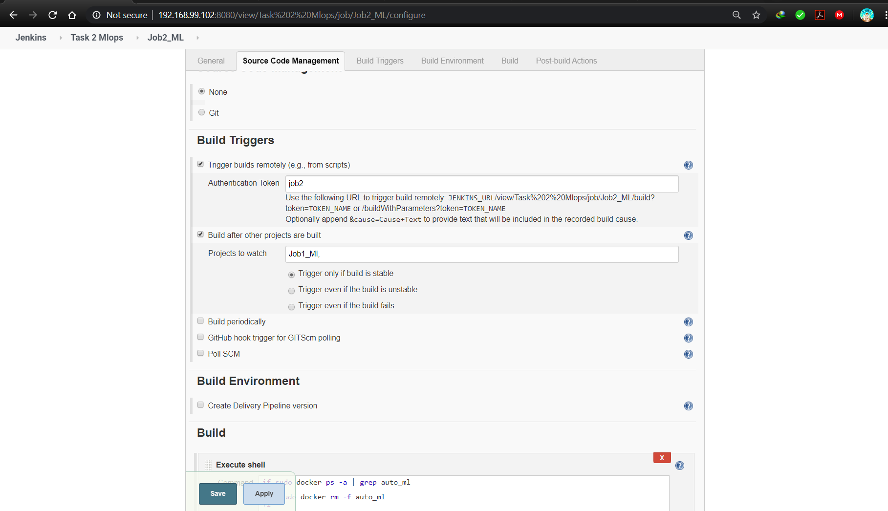
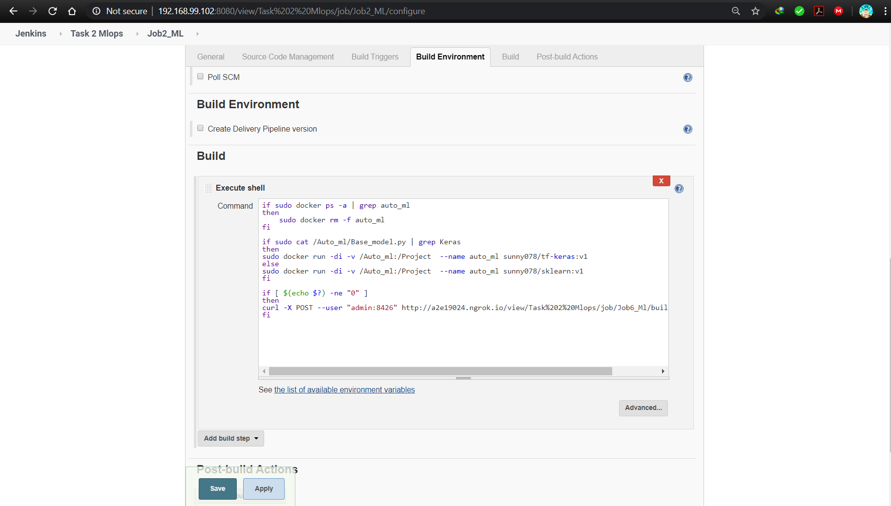
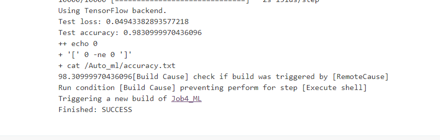
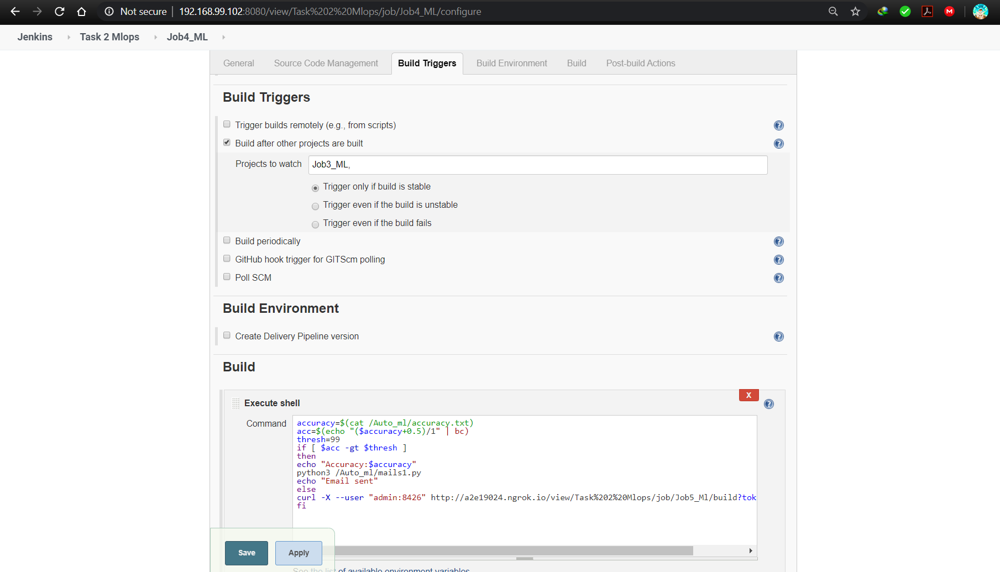
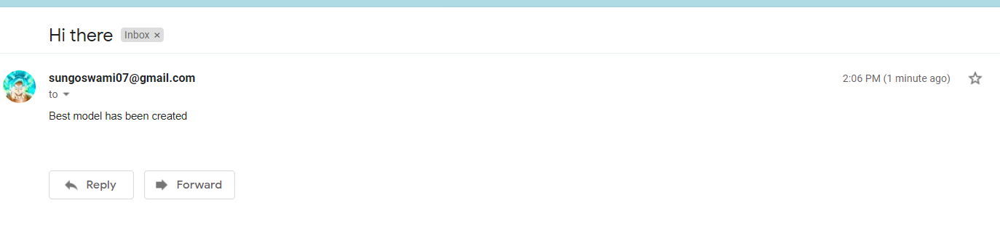
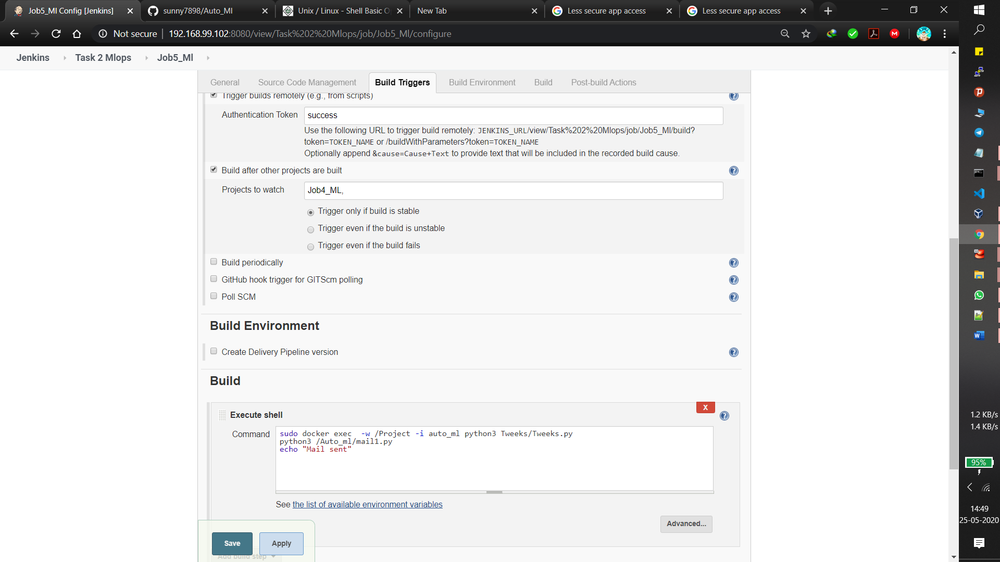
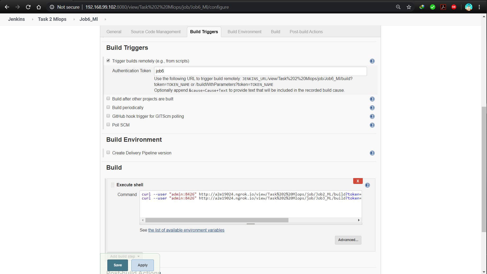

# Auto_Ml
Problem Statement:

1.	Create container image that’s has Python3 and Keras or numpy  installed  using dockerfile 

2.	When we launch this image, it should automatically starts train the model in the container.

3.	Create a job chain of job1, job2, job3, job4 and job5 using build pipeline plugin in Jenkins 

4.	 Job1 : Pull  the Github repo automatically when some developers push repo to Github.

5.	 Job2 : By looking at the code or program file, Jenkins should automatically start the respective machine learning software installed interpreter install image container to deploy code  and start training( eg. If code uses CNN, then Jenkins should start the container that has already installed all the softwares required for the cnn processing).

7.	Job3 : Run the model and display the accuracy.

8.	Job4: if metrics accuracy is less than 99%, then tweak the machine learning model architecture and retrain it.
Notify that the best model is being created

9. job5: Run the tweak file till the model gets an accuracy atleast as that required by threshold. After recieving the accuracy sent a mail to the admin that the best model is created.

10.	Create one extra  job6 for monitor - if the model was not trained due to some reason then it will be trained again.

# Steps:

1. Upload your Machine learning code to gitHub by commiting to local git 
You can also create a hook to automatically push it to github while commiting.

2. After this create a docker file in redhat and install your requirements in it.

3. Now start your jenkins and start creating jobs.

# Job 1 : 
This will pull the code from github as soon as it is uploaded and copy it to the directory specified.

# Job 2 : 

This job will run after job 1.

By looking at the code or program file, Jenkins will automatically start the respective dockerfile and start training.

# Job 3 :

It will run the model, and will display the accuracy and will trigger the next job.

# Job 4 :

If the accuracy of the model is correct, this job will send an email to the admin, that the best model is created.

Output if accuracy is correct: 

Otherwise next job will be triggerred

# Job 5:

This job will run the Tweeks.py file in which which the model is tweeked with some changes. It keeps on running till the time model doesnot achieve atleast the threshold accuracy.

After the best model is created a mail will be sent to the admin that the best model is created.

# Job 6 :

In this, i have used the concept of exit code to monitor if 

a. The container is running properly
b. The model is trained Successfullyl

In a case of failure respective jobs will be re-triggered using this job

And The Task is completed !!!!!
